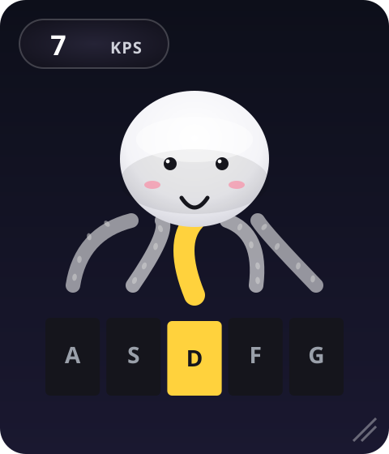

<div align="center">

# 🐙 JamProject Octopus

**A standalone desktop overlay companion for [JamProject](https://jamproject.net) — an animated octopus that reacts to your keystrokes in real time, with a live KPS counter for streamers.**

[](https://github.com/Molax/jamproject-octopus/releases/latest)
[](https://github.com/Molax/jamproject-octopus/releases)
[](LICENSE)
[](https://www.python.org/)
[](https://www.riverbankcomputing.com/software/pyqt/)
[](#-using-with-obs)

<p>
  <a href="https://github.com/Molax/jamproject-octopus/releases/latest"><strong>⬇ Download</strong></a> ·
  <a href="https://jamproject.net"><strong>Play JamProject</strong></a> ·
  <a href="#-running-from-source"><strong>Run from source</strong></a> ·
  <a href="https://github.com/Molax/jamproject-octopus/issues"><strong>Report a bug</strong></a>
</p>



<sub>5-lane preview · the <strong>D</strong> key is pressed (yellow tentacle reaches up, key pressed in)</sub>

</div>

---

## ✨ What it does

JamProject Octopus is a small, transparent, always-on-top window that mirrors the in-game **Octopus Overlay** from [jamproject.net](https://jamproject.net) — but as a native desktop window so streamers can capture it in OBS, drop it on a second monitor, or run it while playing any other rhythm game (osu!, Clone Hero, Stepmania, FNF, etc.).

It listens to your **global keyboard** (3 to 9 lanes, your pick), and the animated octopus:

- 🐙 **Reacts per lane** — tentacles wave, suckers light up, and color-coded keys press down
- ⚡ **Shows live KPS** *(keys per second over a 1-second rolling window)* with a hot-pill state at ≥ 8 KPS
- 😄 **Has multiple moods** — *normal · happy · focused · hyped · panic · despair · oops · transcendent* — driven by KPS and recent misses
- 👁️ **Eye tracking** — pupils glance toward whichever lanes are pressed
- 🎹 **GUI key setup** — configure everything via right-click menu, no text-file editing needed
- 🔁 **Double / alt key per lane** — map two physical keys to the same lane (streaming alternation, accessibility)

## 💻 Requirements

- **OS:** Windows 10/11, Linux (X11 or Wayland with XWayland), or macOS
- **Python:** 3.10 or newer
- **Permission on macOS / Wayland:** global keyboard capture needs Accessibility / input-monitoring permission (see [Platform notes](#-platform-notes))

## ⬇ Download

### Pre-built binaries *(coming with the first tagged release)*

| OS | Format | Download |
| :--- | :--- | :--- |
| 🪟 Windows 10/11 (x64) | `.exe` (PyInstaller, single-file) | [`JamProject-Octopus-windows-x64.exe`](https://github.com/Molax/jamproject-octopus/releases/latest) |
| 🐧 Linux (x86_64) | Standalone binary | [`JamProject-Octopus-linux-x64`](https://github.com/Molax/jamproject-octopus/releases/latest) |
| 🍎 macOS (universal) | `.app` zip | [`JamProject-Octopus-macos.zip`](https://github.com/Molax/jamproject-octopus/releases/latest) |

Until then, follow [Running from source](#-running-from-source) — it's one double-click.

## 🚀 Running from source

### The easy way (recommended)

```
# Windows — double-click run.bat  (or from cmd/PowerShell:)
run.bat

# Linux / macOS
bash run.sh
```

`run.bat` / `run.sh` create an isolated Python virtual environment, install all dependencies automatically on first run, and launch the app. No manual pip, no system pollution.

### Manual

```bash
git clone https://github.com/Molax/jamproject-octopus.git
cd jamproject-octopus

python -m venv .venv
# Windows:  .venv\Scripts\activate
# Linux/Mac: source .venv/bin/activate

pip install -r requirements.txt
python octopus.py
```

A transparent, frameless window appears in the bottom-right corner of your primary screen. Start typing — the octopus is now listening globally to your keyboard.

## 🎹 Configuring keys — GUI

**Right-click the octopus → 🎹 Configurar Teclas…**

A dialog opens where you can:

1. **Choose lane count** (3–9) with a spinner — the octopus grows or shrinks to match.
2. **Assign keys per lane** — click any key button, then press the physical key you want. ESC cancels without changing the current key.
3. **Enable Double (alt key) per lane** — check the *Double* checkbox on a lane and assign a second key. Both keys will trigger the same lane. Great for osu! streaming (alternating Z/X for single-lane, D/F for two-lane doubles) or accessibility remapping.
4. **Save as preset** — type a name and click *Salvar* to write the layout to your `presets.toml` so it appears in the Preset menu for quick switching later.

Settings persist in `~/.jamproject/octopus-desktop.json`.

## 🎮 Key mappings — text mode (presets.toml)

Open [`presets.toml`](presets.toml) in any text editor. It looks like this:

```toml
[active]
preset = "guitar-4k"

[preset.guitar-4k]
description = "Guitar Hero / Clone Hero clássico (4 lanes)"
keys = ["a", "s", "d", "f"]

[preset.osu-mania-7k]
description = "osu!mania 7K"
keys = ["s", "d", "f", "space", "j", "k", "l"]
```

- Change the `preset = "..."` line at the top to switch which preset is active.
- Add your own `[preset.<name>]` block with whatever keys you want.
- **Save the file** — the octopus picks up the change live, no restart needed.
- Or right-click the octopus → **Preset → \<name\>** to switch from the menu.

The number of lanes is just `len(keys)` — between **3** and **9**. Mix and match letters, digits, arrow keys, `space`, `shift`, `ctrl`, `alt`, `enter`, `tab`, or symbols like `;` `,` `.` `/`.

Out of the box, `presets.toml` ships with: **guitar-4k**, **guitar-5k**, **osu-mania-4k/5k/6k/7k**, **stepmania-4k**, **fnf-4k**, **dance-8k**.

> Lookup order: `~/.jamproject/presets.toml` (per-user override) wins over the file shipped next to `octopus.py`. Right-click → **Preset → Abrir presets.toml…** opens whichever is active in your OS's default editor.

## 🔁 Double / alt key setup

Each lane supports an **optional secondary key** that maps to the same tentacle. Use cases:

| Scenario | Example |
| :--- | :--- |
| osu! single streaming (alternating fingers) | Lane 1: `z` + alt `x` |
| Clone Hero two-hand grip | Lane 3: `d` + alt `k` |
| Accessibility (mirror layout) | Every lane gets a symmetric alt |

Configure via **right-click → 🎹 Configurar Teclas…** → enable *Double* checkbox on any lane.

Double assignments are saved to `~/.jamproject/octopus-desktop.json` and are independent of presets.

## 🪟 Controls

| Action | Gesture |
| :--- | :--- |
| Move the window | Left-click + drag anywhere |
| Resize | Drag the small triangle in the bottom-right corner *(aspect ratio is locked at 200:240)* |
| Open menu | Right-click anywhere |
| Configure keys / doubles | Right-click → **🎹 Configurar Teclas…** |
| Switch preset | Right-click → **Preset → \<name\>** |
| Reset combo / KPS | Right-click → **Reset combo/KPS** |
| Toggle KPS pill | Right-click → **Mostrar KPS** |
| Close | Right-click → **Fechar** *(also via the close button in your taskbar)* |

Window position, size, and all key settings persist across runs in `~/.jamproject/octopus-desktop.json`.

## 📹 Using with OBS

The overlay window has a fully transparent background, so:

1. Add a **Window Capture** source in OBS.
2. Pick the **Octopus** window.
3. Set the *Capture Method* to one that supports transparency:
   - **Windows:** *"Windows 10 (1903 and up)"* with **Allow transparency** ☑
   - **Linux (X11):** *xcomposite* and check **Capture mouse / Allow transparency**
   - **macOS:** *Display Capture* + a chroma key on the window background works around macOS's lack of per-window alpha capture
4. Crop / position as you like.

The octopus will composite cleanly on top of your gameplay capture, your face cam, or your background.

## 🛠️ Building binaries from source

We use [PyInstaller](https://pyinstaller.org/) to produce single-file native binaries. The release workflow in [`.github/workflows/release.yml`](.github/workflows/release.yml) builds for all three platforms in CI; you can reproduce any of them locally:

```bash
pip install pyinstaller
pyinstaller --onefile --noconsole --name JamProject-Octopus octopus.py
# Output → dist/JamProject-Octopus(.exe)
```

The bundled binary contains everything (Python interpreter, PyQt6, pynput) — no system Python required on the target machine.

## 🐍 Platform notes

### Windows
Works out of the box. SmartScreen may complain about unsigned binaries the first time you run a release `.exe` — see [About the Windows SmartScreen warning](#%EF%B8%8F-about-the-windows-smartscreen-warning).

### Linux (X11)
Works out of the box.

### Linux (Wayland)
Wayland blocks global keyboard listeners by design for security. You'll need either:
- An **XWayland** fallback (most desktops, but global keys are limited), or
- Run inside an X11 session, or
- Use `libinput` directly (requires root or the `input` group) — out of scope for this tool.

### macOS
macOS requires you to grant **Input Monitoring** and **Accessibility** permission to whatever launches the script (Terminal, iTerm, or the packaged `.app`):

`System Settings → Privacy & Security → Input Monitoring` → ☑ enable for Terminal/iTerm/JamProject-Octopus.

## ⚠️ About the Windows SmartScreen warning

Pre-built `.exe` binaries are **not yet code-signed**, so SmartScreen may show a *"Windows protected your PC"* popup. The build is reproducible from this repo — feel free to compile yourself with PyInstaller and diff against the released artifact.

To proceed past SmartScreen: click **"More info"** → **"Run anyway"**.

## 🤝 Bridge with the web game

This is a **standalone tool** — it does **not** read state from `jamproject.net`. It listens to your keyboard only. The intent is twofold:

1. **Streamers** who play JamProject (or anything else) get a stylish overlay that mirrors the web game's mascot.
2. **Anyone learning a rhythm game** gets a finger-level KPS / lane-heat readout in front of them on a second monitor without needing to alt-tab.

A future version may speak to the web app over a local websocket so the desktop octopus shows match score, accuracy, and combo from the actual game session. Not yet — open an issue if you want it.

## 🗺️ Roadmap

- [x] **Phase 1 — MVP** — PyQt6 frameless transparent window, global keyboard via pynput, mood states, draggable + resizable, presets.toml-driven keybindings, config persistence
- [x] **Phase 2a — GUI key setup** — right-click dialog to configure 3–9 lanes, assign keys by pressing them, double/alt key per lane, save as preset
- [ ] **Phase 2b — Distribution** — PyInstaller release pipeline (Win/Linux/macOS), GitHub Releases auto-upload, code-sign Windows binary
- [ ] **Phase 3 — Polish** — system tray icon, preset themes, optional chroma-key background for OBS on macOS
- [ ] **Phase 4 — Bridge** — local-websocket protocol so `jamproject.net` can drive the desktop octopus with real game state (accuracy, mood from misses)

## 📁 Repository layout

```
jamproject-octopus/
├── octopus.py              # The whole app — single Python file, no external assets
├── run.bat                 # Windows: one double-click install + launch
├── run.sh                  # Linux/macOS: one command install + launch
├── presets.toml            # Default key presets (shipped; user copy goes to ~/.jamproject/)
├── requirements.txt        # PyQt6 + pynput
├── LICENSE                 # MIT
├── CONTRIBUTING.md         # Dev setup, PR checklist, style
└── .github/
    ├── workflows/
    │   ├── ci.yml          # Lint + py_compile on PR
    │   └── release.yml     # PyInstaller build on tag push
    ├── ISSUE_TEMPLATE/     # bug_report / feature_request
    ├── PULL_REQUEST_TEMPLATE.md
    ├── dependabot.yml
    └── FUNDING.yml
```

## 🐛 Reporting bugs

Open an [issue](https://github.com/Molax/jamproject-octopus/issues/new/choose) with:

- Your OS + version (`winver` on Windows; `uname -a` on Linux/Mac)
- Python version (`python --version`)
- App version (release tag or commit hash)
- Steps to reproduce
- Any errors in the terminal where you launched it

For web-side bugs in JamProject itself (gameplay, scoring, songs, account), please file them at [jamproject.net](https://jamproject.net) — those don't live in this repo.

## 📄 License

[MIT](LICENSE) — go wild. The octopus visual design / character is shared with [JamProject](https://jamproject.net) and the [jam-legend-revival](https://github.com/Molax/jam-legend-revival) web frontend (where the Angular source of the in-game version lives).

## 🙏 Acknowledgements

- **[PyQt6](https://www.riverbankcomputing.com/software/pyqt/)** — Qt bindings that make a transparent, always-on-top window two lines of code
- **[pynput](https://pynput.readthedocs.io/)** — cross-platform global keyboard listener
- **[JamProject Beta 1 Bronze (2011)](https://jamproject.net)** — the Flash-era rhythm game we're keeping alive

---

<div align="center">
  <sub>Built with 🐍 Python + 🐙 Qt · part of the <a href="https://jamproject.net">JamProject</a> family · siblings: <a href="https://github.com/Molax/jamproject-desktop">jamproject-desktop</a> · <a href="https://github.com/Molax/jam-legend-revival">jam-legend-revival</a></sub>
</div>
